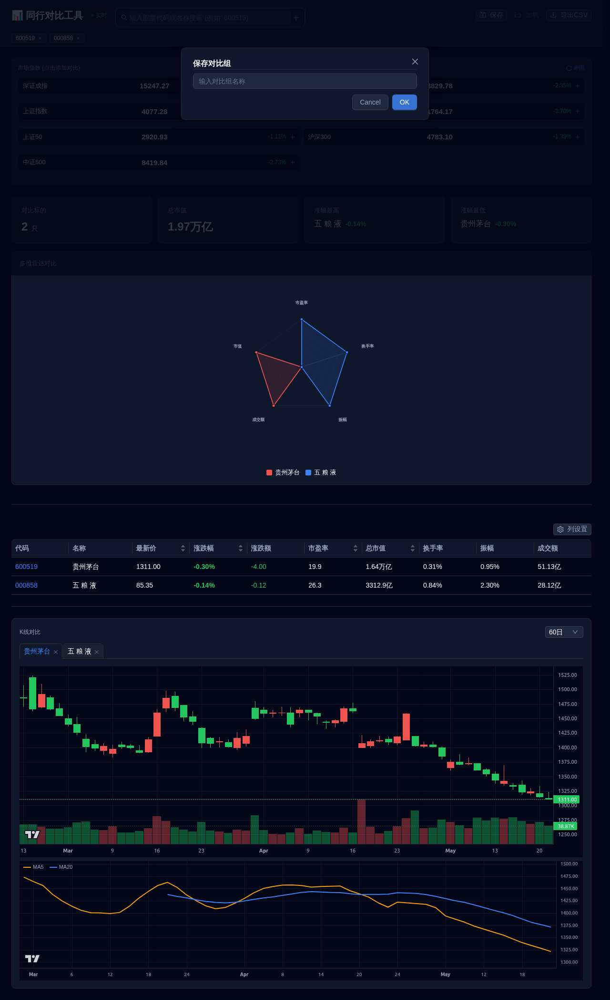
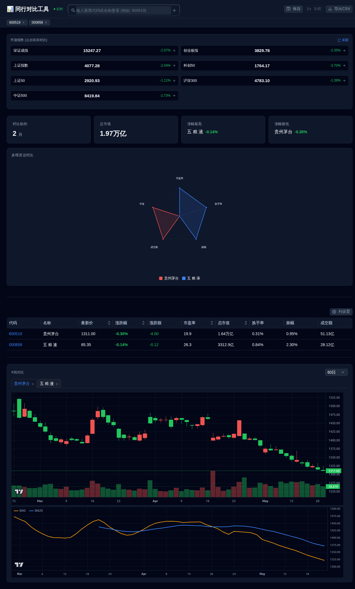

# A-Share Stock Peer Comparison (A股同行对比工具)

> ⚠️ **Disclaimer / 免责声明**
>
> This tool is for **educational and research purposes only**. Data is sourced from publicly available Chinese financial APIs (Tencent, Sina). It does **not** provide financial advice, investment recommendations, or real-time trading data. Use at your own risk.
>
> 本工具仅供**学习与研究用途**。数据来源于腾讯、新浪等公开行情接口，不构成任何投资建议，不提供实时交易数据。使用风险自负。


> An open-source, Docker-ready web tool for comparing A-share stocks (中国大陆A股) side-by-side — radar chart, K-line with 3-level failover, real-time polling, and a dark OLED-themed UI.

---

## 截图预览

| 功能 | 预览 |
|------|------|
| **主界面**（对比表格+KPI+雷达图+K线+大盘指数） |  |
| **保存对比组** |  |
| **个股详情弹窗** |  |
| **列设置**（列显隐切换） |  |

## 🇨🇳 中文说明

### 这是什么？

一个轻量的 A 股同行对比工具，帮你快速对比多只股票的核心指标：

- 🔍 **搜索添加** — 输入股票代码/拼音首字母，实时搜索
- 📊 **同行对比表格** — 15 个字段（PE、换手率、成交额、市值…），支持列显隐、排序
- 🕹️ **雷达图** — 2 只以上股票时自动生成多维度对比雷达图
- 📈 **K 线图** — 蜡烛图 + 成交量 + MA5/MA20，支持 7/30/60/120 日周期，三级数据源自动回退
- 🏛️ **大盘指数卡片** — 上证、深证、创业板等 7 大指数自动轮询
- 🔄 **智能轮询** — 仅交易日盘中刷新（9:30-11:30 / 13:00-15:00），30 秒间隔，页面不可见时自动暂停
- 💾 **保存对比组** — localStorage 持久化，刷新不丢
- 📥 **导出 CSV** — 一键导出当前对比数据

### 技术栈

| 层 | 技术 |
|----|------|
| 前端 | React 18 + TypeScript + Ant Design 5 + lightweight-charts |
| 后端 | Python 3 + Flask + Gunicorn |
| 数据源 | 腾讯行情(主) → 新浪行情(备1) → 东方财富(备2) 三级容灾 |
| 容器 | Docker + Nginx (多阶段构建，镜像约 200MB) |

### 快速启动

#### 方式一：Docker 一键部署（推荐）

```bash
docker compose up -d
# → http://localhost:80
```

#### 方式二：本地开发

后端：

```bash
cd backend
pip install -r requirements.txt
python3 app.py
# → http://localhost:5000
```

前端：

```bash
cd frontend
npm install
npx vite
# → http://localhost:3000
```

> 注意：`china_stock.py` 在项目根目录，后端会自动导入。

### 云服务器部署

```bash
# 1. 安装 Docker
curl -fsSL https://get.docker.com | sh
sudo usermod -aG docker $USER

# 2. 克隆并启动
git clone https://github.com/mongoby/stock-peer-compare.git
cd stock-peer-compare
docker compose up -d
```

推荐最低配置：1 核 2G（阿里云轻量/腾讯云轻量，约 34 元/月）。

### 项目结构

```
stock-peer-compare/
├── backend/
│   └── app.py              # Flask API (port 5000)
├── frontend/
│   └── src/
│       ├── App.tsx                  # 应用主入口
│       ├── api/stock.ts             # API 封装
│       └── components/
│           ├── SearchBar.tsx         # 股票搜索
│           ├── PeerTable.tsx         # 对比表格
│           ├── KpiCards.tsx          # KPI 卡片
│           ├── KLineTabs.tsx         # K 线 Tab 切换
│           ├── KLineChart.tsx        # K 线渲染
│           ├── MarketOverview.tsx    # 大盘指数
│           ├── StockDetailModal.tsx  # 个股详情弹窗
│           └── RadarChart.tsx        # 雷达图
├── china_stock.py          # A 股数据模块 (~580 行)
├── Dockerfile               # 多阶段构建
├── docker-compose.yml       # 一键部署
├── nginx.conf               # Nginx 配置（代理 + 静态资源）
├── screenshot.png
├── LICENSE
└── README.md
```

---

## 🇬🇧 English

### What is this?

A lightweight, self-hosted web tool for comparing A-share (Chinese stock market) stocks side-by-side. Features multi-dimensional comparison tables, radar charts, K-line charts with 3-level data source failover, and smart real-time polling.

### Features

- **Search & add stocks** — by code or pinyin initials
- **Peer comparison table** — 15 fields (PE ratio, turnover rate, volume, market cap...), sortable, with column visibility toggles
- **Radar chart** — auto-generated when 2+ stocks are selected, covering 5 dimensions
- **K-line chart** — candlestick + volume + MA5/MA20, supports 7/30/60/120-day periods. Auto-failover across 3 data sources
- **Market index cards** — 7 major indices (SSE, SZSE, ChiNext...) refreshed on smart polling
- **Smart polling** — only during trading hours (9:30-11:30 / 13:00-15:00 CST), 30s interval, pauses when page is not visible
- **Save/load groups** — localStorage persistence
- **Export CSV** — one-click export of comparison data

### Screenshots

| Feature | Preview |
|---------|---------|
| **Main UI** (comparison table+KPI+radar+K-line+market indices) |  |
| **Save group** |  |
| **Stock detail modal** |  |
| **Column visibility toggles** |  |

### Tech Stack

| Layer | Technology |
|-------|-----------|
| Frontend | React 18 + TypeScript + Ant Design 5 + lightweight-charts |
| Backend | Python 3 + Flask + Gunicorn |
| Data Sources | Tencent (primary) → Sina (backup 1) → EastMoney (backup 2) |
| Container | Docker + Nginx (multi-stage build, ~200MB image) |

### Quick Start

#### Docker (recommended)

```bash
docker compose up -d
# → http://localhost:80
```

#### Development

```bash
# Backend
cd backend
pip install -r requirements.txt
python3 app.py

# Frontend
cd frontend
npm install
npx vite
```

### Deployment on Cloud Server

```bash
# Minimum: 1 vCPU, 2GB RAM (~$5/month)
curl -fsSL https://get.docker.com | sh
git clone https://github.com/mongoby/stock-peer-compare.git
cd stock-peer-compare
docker compose up -d
```

---

## 🤝 Contributing

Issues and PRs are welcome! Please open an issue first to discuss changes.

For feature requests, please check existing issues first.

## 📄 License

MIT © [mongoby](https://github.com/mongoby)
